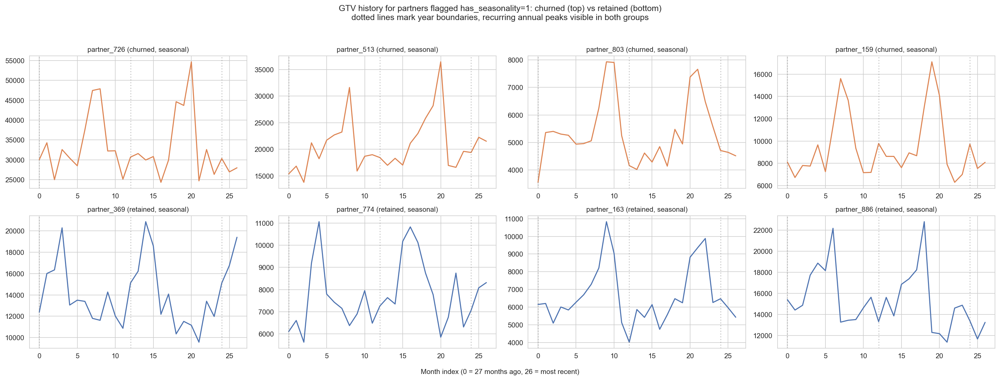

# Partner Churn Prediction

Predicting which B2B partners are at risk of churning next quarter, so a partner management team can prioritize retention outreach before the relationship is gone.

This repository is an **end-to-end deliverable**, not a single notebook: a data pipeline, a modeling notebook, a business-facing summary, a production runbook, and a scored output file, all tied together and reproducible from raw data.

## Business context

This project is built on a fully **synthetic dataset**, not real company or partner data. It was generated to reflect the dynamics I've seen in real partner management programs — GTV (gross transaction value) that grows, declines, or moves seasonally; satisfaction and engagement that erode before a partner disengages; the outsized risk of a partner developing a competitor relationship — so the exercise is a realistic proof of concept for the approach, even though no individual number in it refers to a real business.

**The problem:** partner churn is usually caught late — after GTV has already dropped for a quarter or two and the relationship has gone cold. By that point there's little runway left to intervene. Roughly **1 in 5 partners (20.1%)** churn in a given quarter in this dataset, which is a large enough group that outreach needs to be prioritized, not blanket.

**The approach:** build a model that scores every partner monthly on churn risk, using signals a partner manager already has access to (GTV trend, NPS, engagement, contact cadence, competitor ties), and turn that into a ranked, explainable outreach list rather than a black-box number.

## What's in this repo — start here depending on who you are

| I am a... | Start with |
|---|---|
| Partner management stakeholder, non-technical | [`docs/executive_summary.md`](docs/executive_summary.md) — the business problem, headline findings, and recommended action, in plain language |
| Data scientist / reviewer | [`notebooks/partner_churn_prediction.ipynb`](notebooks/partner_churn_prediction.ipynb) — full EDA, modeling, evaluation, and feature importance |
| Engineer taking this to production | [`src/data_pipeline.py`](src/data_pipeline.py) + [`docs/production_considerations.md`](docs/production_considerations.md) — the reusable feature pipeline and the retraining/monitoring/data-quality plan |
| Just want the output | [`outputs/partner_risk_scores.csv`](outputs/partner_risk_scores.csv) — the ranked, scored partner list this whole project produces |

## Project structure

```
.
├── README.md                       # you are here
├── generate_dataset.py             # generates the synthetic raw data (data/)
├── requirements.txt
├── src/
│   └── data_pipeline.py            # reusable feature engineering: trend, volatility,
│                                    # seasonality, peer/market comparison — re-runnable
│                                    # monthly against a fresh data extract
├── notebooks/
│   └── partner_churn_prediction.ipynb   # EDA -> preprocessing -> modeling -> risk scoring
├── data/
│   ├── partner_static.csv          # raw per-partner attributes + engagement + target
│   ├── partner_gtv_history.csv     # raw 27-month monthly GTV history (long format)
│   └── partner_churn_dataset.csv   # model-ready dataset (static + derived GTV features)
├── outputs/
│   └── partner_risk_scores.csv     # scored, ranked test-set partners — the actual deliverable
├── docs/
│   ├── executive_summary.md        # business-facing findings and recommendation
│   └── production_considerations.md # retraining cadence, drift monitoring, data quality checks
└── images/                         # key charts exported from the notebook (embedded below)
```

## How the pieces connect

1. **`generate_dataset.py`** generates the synthetic raw inputs (`data/partner_static.csv`, `data/partner_gtv_history.csv`), calling into `src/data_pipeline.py` for feature engineering rather than duplicating that logic.
2. **`src/data_pipeline.py`** is the reusable core: given a static partner table and a GTV history table, it computes `gtv_trend_3m`, `gtv_volatility`, `has_seasonality`, `gtv_vs_peers`, and `gtv_vs_market_growth`, and joins them into a model-ready dataset. This is the module a monthly batch job would call in production — see `docs/production_considerations.md` for exactly how.
3. **`notebooks/partner_churn_prediction.ipynb`** imports that pipeline (it does not re-implement feature engineering inline), then runs the full analysis: EDA, an outlier check, a pre-modeling hypothesis, preprocessing, four trained models, evaluation, feature importance compared against the hypothesis, and a risk-scoring section that exports `outputs/partner_risk_scores.csv`.
4. **`docs/executive_summary.md`** translates the notebook's findings into a plain-language business document.
5. **`docs/production_considerations.md`** covers what it takes to run this for real: retrain cadence, drift monitoring, unscheduled-retrain triggers, and data quality checks before each scoring cycle.

## Results

Four models were trained on the same preprocessing pipeline and evaluated on a held-out test set, with **recall** treated as the priority metric — missing an at-risk partner (a false negative) is far costlier than an unnecessary check-in call (a false positive):

| Model | Precision | Recall | F1 | ROC-AUC |
|---|---|---|---|---|
| **Logistic Regression** | 0.650 | **0.650** | 0.650 | 0.916 |
| Gradient Boosting | 0.677 | 0.525 | 0.592 | 0.912 |
| SVM | 0.667 | 0.500 | 0.571 | 0.897 |
| Random Forest | 0.708 | 0.425 | 0.531 | 0.908 |

Logistic Regression wins on recall in this run and was used to generate the risk-scoring output below, with the added benefit that its coefficients are directly explainable to a non-technical partner management audience.

### Churn rate by segment


### GTV history: seasonality is real, and it isn't a risk factor

Partners flagged `has_seasonality=1` show a genuine recurring annual peak — visible across multiple year boundaries here for both churned and retained partners — confirming that a seasonal business pattern is just a shape to plan around, not a churn signal by itself.



### Feature importance

Both the linear model's coefficients and the tree ensembles' importances converge on the same short list of drivers — GTV trend, NPS, engagement, contact gap, and competitor relationship — which is exactly what the EDA-stage hypothesis in the notebook predicted before any model was trained.


### Model comparison (ROC)


### Risk score distribution


## The reflection that matters most

The biggest lesson from this project isn't which algorithm won. All four models — a linear model, a margin-based model, and two tree ensembles — converged on the same five drivers of churn, and those drivers matched what a partner manager would predict from experience *before* any model was trained. That agreement came from the quality and completeness of the underlying signals (clean NPS, engagement, GTV trend, and contact history), not from algorithm choice or hyperparameter tuning.

> **Data quality and completeness matter more for model performance than algorithm choice or hyperparameter tuning.** A well-instrumented but simple model — clean, complete, well-understood features — beats a sophisticated model fed noisy or incomplete data, almost every time.

If this were prioritized for a real partner program, the highest-leverage investment wouldn't be swapping Gradient Boosting for something fancier — it would be making sure NPS surveys get filled out, engagement events get logged consistently, and contact history is tracked reliably. See [`docs/production_considerations.md`](docs/production_considerations.md) for the data quality checks this project recommends running before every scoring cycle to protect exactly that.

## Getting started

```bash
pip install -r requirements.txt
python generate_dataset.py          # generates data/*.csv
jupyter notebook notebooks/partner_churn_prediction.ipynb
```

Running the notebook end to end reproduces every chart in `images/` and regenerates `outputs/partner_risk_scores.csv`.
