# Partner Churn Prediction

Predicting which B2B partners are at risk of churning next quarter, so a partner management team can prioritize retention outreach before the relationship is gone.

This repository is an **end-to-end deliverable**, not a single notebook: a data pipeline, a modeling notebook, a business-facing summary, a production runbook, and a scored output file, all tied together and reproducible from raw data.

## Business context

This project is built on a fully **synthetic dataset**, not real company or partner data. It was generated to reflect the dynamics I've seen in real partner management programs — GTV (gross transaction value) that grows, declines, or moves seasonally; satisfaction and engagement that erode before a partner disengages; the outsized risk of a partner developing a competitor relationship — so the exercise is a realistic proof of concept for the approach, even though no individual number in it refers to a real business.

**The problem:** partner churn is usually caught late — after GTV has already dropped for a quarter or two and the relationship has gone cold. By that point there's little runway left to intervene. Roughly **1 in 5 partners** churn in a given quarter in this dataset, which is a large enough group that outreach needs to be prioritized, not blanket.

**The approach:** build a model that scores every partner on churn risk using signals a partner manager already has access to (GTV trend, NPS, engagement, contact cadence, competitor ties), evaluate it the way it will actually be used (trained on the past, scored on the present), and turn that into a ranked, capacity-sized, explainable outreach list rather than a black-box number.

## A significant methodology upgrade

The current version closes six gaps I wasn't willing to leave in an earlier pass, since fixing them changed the underlying feature set and — honestly — the reported metrics:

1. **Fixed a seasonality-trend bug.** The original 3-month trend feature misread a seasonal partner's normal post-peak decline as churn risk. Added a year-over-year trend comparison and an STL-based seasonal-deviation feature that nets out the expected seasonal shape.
2. **Added a cold-start segment for new partners.** Partners under 9 months tenure get a distinct, simpler feature set (a cohort-ramp benchmark instead of an unreliable trend/seasonality block), flagged via a `scoring_path` column.
3. **Switched to a temporal train/validation/test split.** Three quarterly snapshots per partner, not one — trained on the earliest, evaluated on the latest — instead of a random split that silently assumed the model would be deployed on data from the same time window it was trained on.
4. **Replaced arbitrary risk thresholds with a capacity-aware, cost-based ranking**, after discovering that a single probability cutoff is mathematically degenerate under realistic cost assumptions here (see Results below).
5. **Added SHAP explanations**, so a partner manager can see exactly *why* a specific partner was flagged.
6. **Added a complementary survival-analysis view** (Cox Proportional Hazards), estimating *when* a partner is likely to churn, not just *whether* — useful for sequencing outreach by urgency.

## What's in this repo — start here depending on who you are

| I am a... | Start with |
|---|---|
| Partner management stakeholder, non-technical | [`docs/executive_summary.md`](docs/executive_summary.md) — the business problem, headline findings, and recommended action, in plain language |
| Data scientist / reviewer | [`notebooks/partner_churn_prediction.ipynb`](notebooks/partner_churn_prediction.ipynb) — full EDA, temporal validation, modeling, SHAP, and survival analysis |
| Engineer taking this to production | [`src/data_pipeline.py`](src/data_pipeline.py) + [`docs/production_considerations.md`](docs/production_considerations.md) — the reusable feature/snapshot pipeline and the retraining/monitoring/data-quality plan |
| Just want the output | [`outputs/partner_risk_scores.csv`](outputs/partner_risk_scores.csv) — the ranked, scored, capacity-sized partner list this whole project produces |

## Project structure

```
.
├── README.md                       # you are here
├── generate_dataset.py             # generates the synthetic raw data (data/)
├── requirements.txt
├── src/
│   └── data_pipeline.py            # reusable feature engineering: trend, yoy trend, seasonal
│                                    # deviation (STL), volatility, seasonality, peer/market
│                                    # comparison, cold-start cohort-ramp, and the multi-snapshot
│                                    # orchestrator (build_snapshot_dataset) — re-runnable
│                                    # monthly against a fresh data extract
├── notebooks/
│   └── partner_churn_prediction.ipynb   # EDA -> temporal split -> modeling -> cost threshold ->
│                                         # SHAP -> risk scoring -> survival analysis
├── data/
│   ├── partner_static.csv          # raw per-partner attributes + engagement + target (current/"test" snapshot)
│   ├── partner_gtv_history.csv     # raw 33-month monthly GTV history (long format)
│   └── partner_snapshots.csv       # model-ready dataset: 3 quarterly snapshots per partner
│                                    # (train/validation/test), each computed with no future leakage
├── outputs/
│   └── partner_risk_scores.csv     # scored, ranked, capacity-tiered current-book partners — the actual deliverable
├── docs/
│   ├── executive_summary.md        # business-facing findings and recommendation
│   └── production_considerations.md # retraining cadence, drift monitoring, data quality checks
└── images/                         # key charts exported from the notebook (embedded below)
```

## How the pieces connect

1. **`generate_dataset.py`** generates the synthetic raw inputs and walks through three quarterly snapshots per partner (evolving engagement/health signals with realistic persistence, not independent redraws), calling into `src/data_pipeline.py` for all feature engineering rather than duplicating that logic.
2. **`src/data_pipeline.py`** is the reusable core: given a static partner table and a GTV history table (optionally truncated to a point-in-time cutoff), it computes `gtv_trend_3m`, `gtv_trend_yoy_3m`, `gtv_seasonal_deviation_pct`, `gtv_volatility`, `has_seasonality`, `gtv_vs_peers`, `gtv_vs_market_growth`, and — for new partners — `gtv_ramp_vs_cohort`, then joins them into a model-ready dataset. `build_snapshot_dataset` calls this once per snapshot cutoff to build the full temporal table with zero changes to the underlying feature functions. This is the module a monthly batch job would call in production — see `docs/production_considerations.md` for exactly how.
3. **`notebooks/partner_churn_prediction.ipynb`** imports that pipeline (it does not re-implement feature engineering inline), then runs the full analysis: EDA restricted to the training snapshot only, a direct before/after demonstration of the seasonality fix, a cold-start cohort-ramp check, a temporal train/validation/test split, four trained models, a cost-based capacity-aware risk-tiering scheme, SHAP explanations, a risk-scoring section that exports `outputs/partner_risk_scores.csv`, and a complementary Cox Proportional Hazards survival analysis.
4. **`docs/executive_summary.md`** translates the notebook's findings into a plain-language business document.
5. **`docs/production_considerations.md`** covers what it takes to run this for real: retrain cadence (now built around rolling the snapshot window forward), drift monitoring, unscheduled-retrain triggers, and data quality checks before each scoring cycle.

## Results

Four models were trained on `train`, selected on `validation`, and reported on `test` — three genuinely separate quarterly snapshots, not a random split of one. **Recall** is the priority metric — missing an at-risk partner (a false negative) is far costlier than an unnecessary check-in call (a false positive):

| Model | Precision | Recall | F1 | ROC-AUC |
|---|---|---|---|---|
| **Logistic Regression** | 0.597 | **0.562** | 0.579 | 0.878 |
| Gradient Boosting | 0.575 | 0.521 | 0.546 | 0.871 |
| SVM | 0.601 | 0.510 | 0.552 | 0.844 |
| Random Forest | 0.629 | 0.495 | 0.554 | 0.874 |

Logistic Regression wins on recall — the same winner as before this round of changes, which is itself a useful confirmation that the winner wasn't an artifact of an easier evaluation. **These numbers are lower than an earlier version of this analysis reported** (Logistic Regression previously showed 0.650/0.650/0.650/0.916 on a random 80/20 split of a single snapshot). That drop isn't a regression — the random split let the model implicitly see patterns from the same time window it was tested on, which a model deployed forward in time will never get to do. The numbers above are measured on a snapshot strictly later in time than what the model trained on, which is a more honest estimate of real-world performance.

### Churn rate by segment

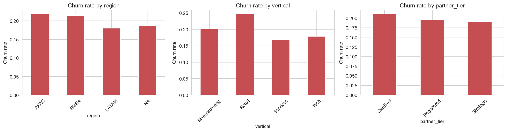

### The seasonality fix, before vs. after

23 mature seasonal partners whose *old* trend feature read as a ~-30% decline — the kind of reading that would wrongly land them on a retention-outreach list — show close to 0% on both new features once seasonality is netted out. They were just in their normal season, not actually at risk.

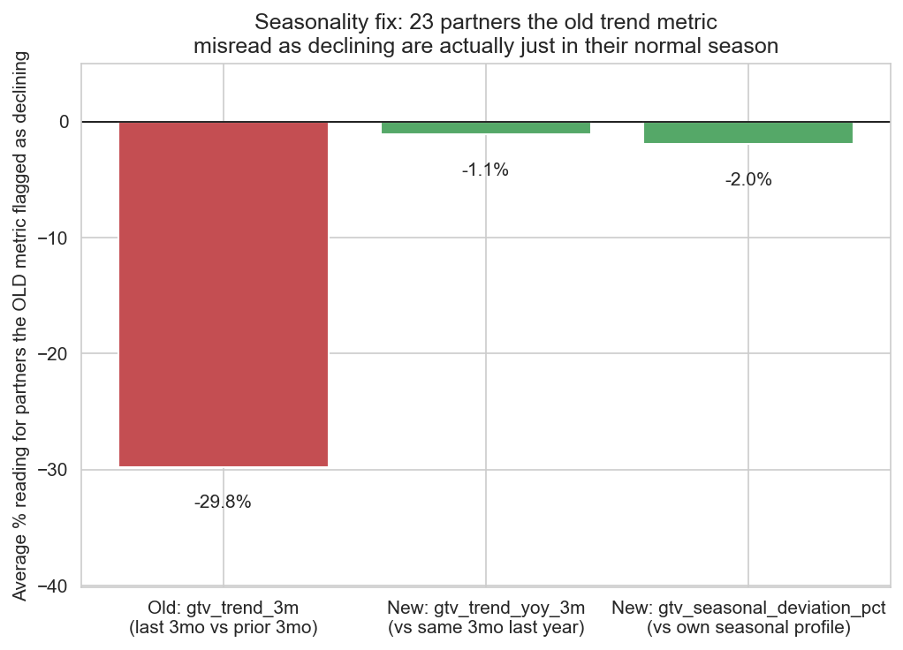

### Cold-start segment: cohort-ramp benchmark for new partners

Partners under 9 months tenure get a distinct feature (`gtv_ramp_vs_cohort`) instead of an unreliable trend/seasonality read built on a few months of noisy history.

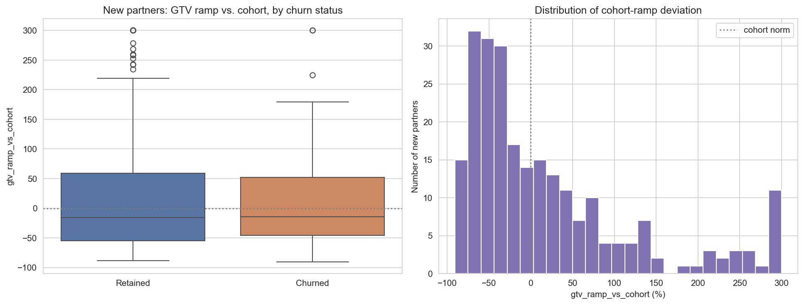

### Cost-based decision threshold

A flat probability cutoff turned out to be mathematically degenerate here: under the cost assumptions used ($100 per unnecessary call vs. a false-negative cost scaled to each partner's GTV), pure expected-cost minimization pushes toward flagging almost the entire book — because even a small missed churn costs far more than hundreds of extra calls. That's a genuine finding, not a dead end: it means the real missing ingredient is a **capacity constraint**. The notebook replaces a single threshold with a ranking by expected cost of inaction, sized to what a team can actually act on (illustrative: top 10% get a call, next 20% get a lighter-touch nudge).

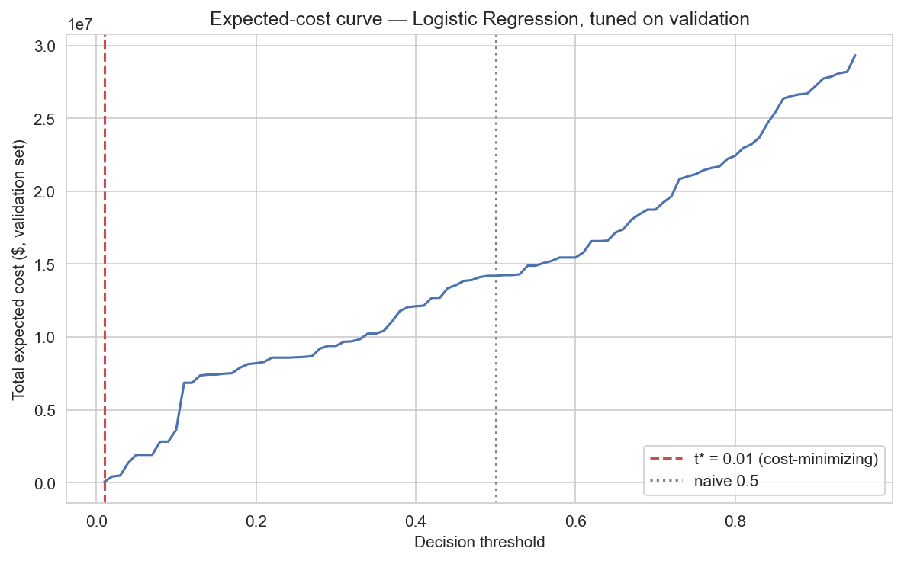

### Feature importance

The linear model's coefficients and the tree ensembles' importances converge on the same short list of drivers — NPS, engagement, contact gap, and competitor relationship near the top, with the new year-over-year/seasonal-deviation features correctly showing up as *corrections* for a subgroup rather than a wholesale replacement for the raw trend.

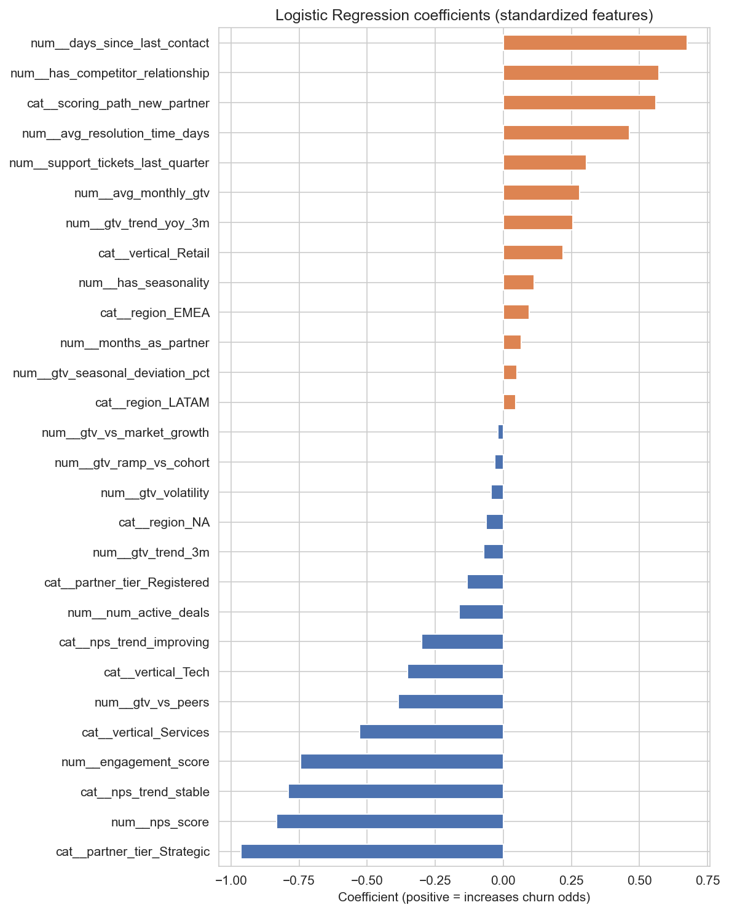
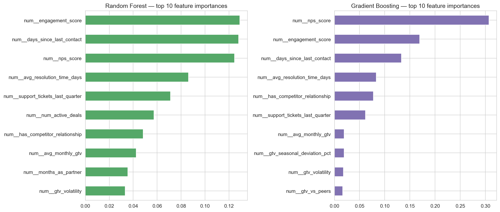

### Model comparison (ROC)

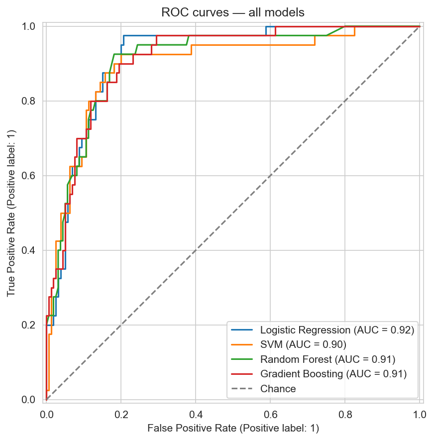

### SHAP: global and individual explanations

Beyond feature importance, SHAP shows exactly how each feature pushed one specific partner's prediction up or down — the difference between "85% churn probability" and "85%, driven mainly by X and Y."

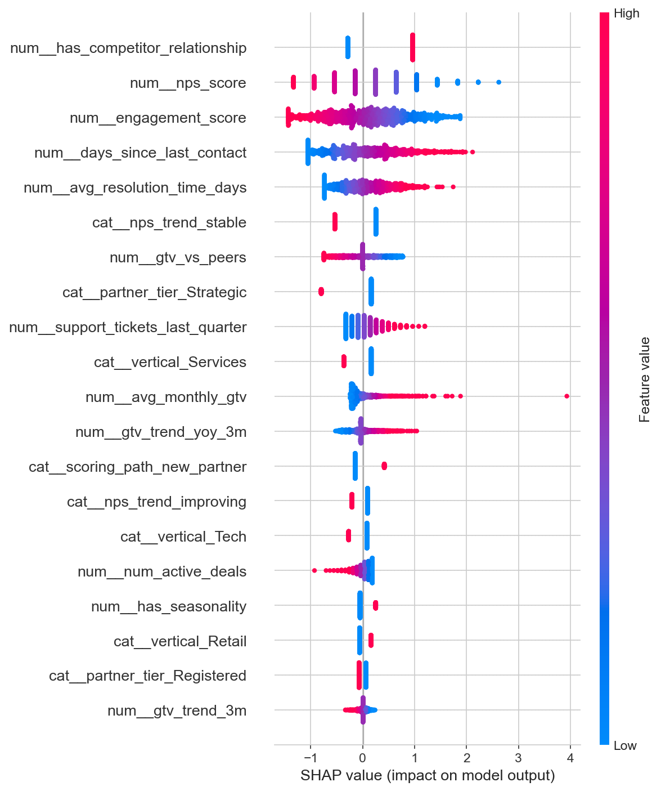
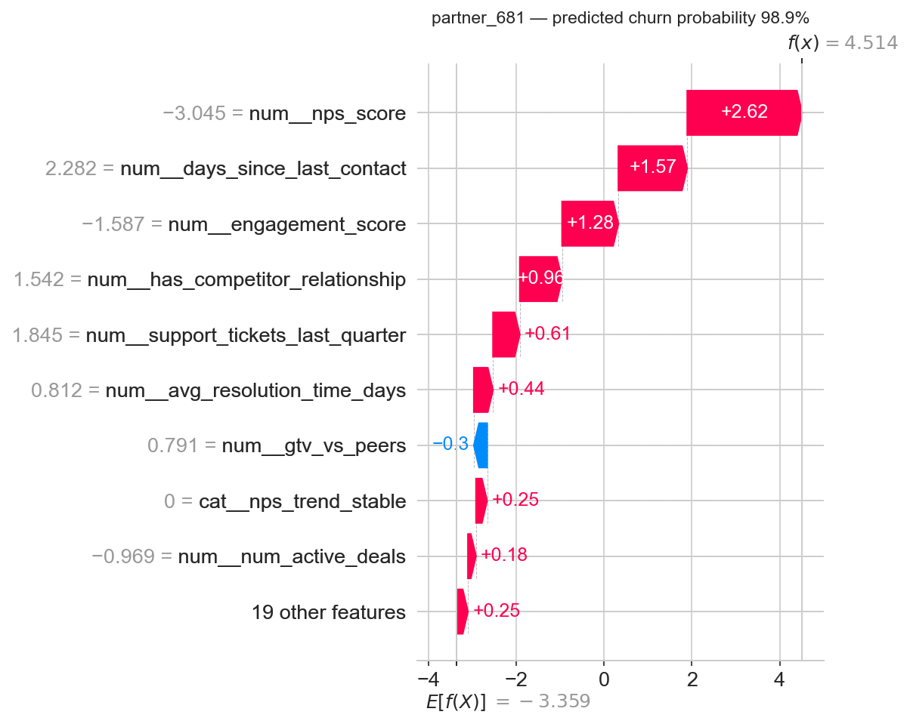

### Risk score distribution (capacity-tiered)

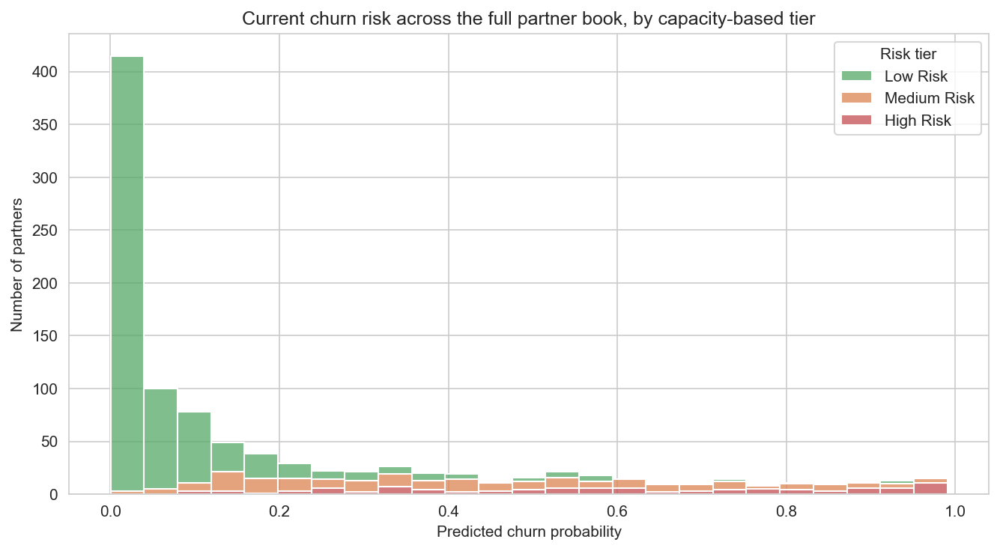

### Survival analysis: same risk tier, different urgency

Two partners can carry a near-identical churn probability yet have very different expected time-to-churn — useful for sequencing outreach when the high-risk list outgrows what a team can act on in one cycle.

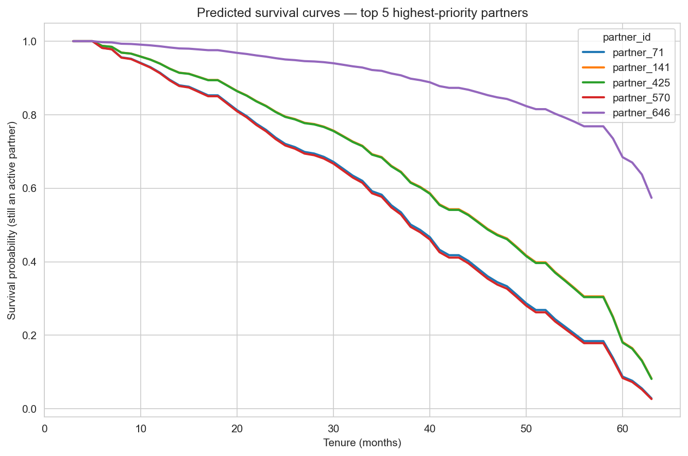

## The reflection that matters most

None of the six fixes in this round were about swapping in a fancier algorithm — Logistic Regression won before this round of changes and still wins after it. Every fix was about the *inputs* being wrong or incomplete: a trend feature that misread seasonality, features forced onto partners who didn't have enough history to support them, a validation split that didn't reflect how the model would actually be used, thresholds untethered from real costs.

> **Data quality, feature correctness, and evaluation methodology matter more for model performance than algorithm choice or hyperparameter tuning.** A well-instrumented but simple model — clean, complete, well-understood, *correctly computed* features, evaluated the way it will actually be used — beats a sophisticated model fed noisy, incomplete, or wrongly-evaluated data almost every time.

If this were prioritized for a real partner program, the highest-leverage investment still wouldn't be swapping Gradient Boosting for something fancier — it would be making sure NPS surveys get filled out, engagement events get logged consistently, contact history is tracked reliably, and — this round's addition to the lesson — that the features and evaluation methodology built on top of that data are actually correct. See [`docs/production_considerations.md`](docs/production_considerations.md) for the data quality checks this project recommends running before every scoring cycle to protect exactly that.

## Getting started

```bash
pip install -r requirements.txt
python generate_dataset.py          # generates data/*.csv, including the 3-snapshot partner_snapshots.csv
jupyter notebook notebooks/partner_churn_prediction.ipynb
```

Running the notebook end to end reproduces every chart in `images/` and regenerates `outputs/partner_risk_scores.csv`.
